# Rug Guardian: One-Stop Solution for Rug-Pull Identification 🚨

Rug Guardian is a comprehensive tool designed to identify potential rug pulls in blockchain projects. By analyzing trading volumes, transaction history, and company backing, the platform helps users detect fraudulent activity and avoid scams.

---

## Key Features

### 1️⃣ Volume Analysis 📊
Analyze trading volumes to detect irregularities and fake activity:
- **24h Volume Patterns**: Identify sudden spikes or dips.
- **Cross-Exchange Volume**: Verify consistency across platforms.
- **Historical Volume Data**: Examine long-term trends for anomalies.

### 2️⃣ Transaction History 🔗
Evaluate blockchain transaction data for suspicious patterns:
- **Large Wallet Movements**: Detect unusual activities by whales.
- **Developer Wallet Activity**: Track fund transfers from project developers.
- **Transaction Time Patterns**: Identify odd or automated transaction timings.

### 3️⃣ Company Verification 🏢
Assess the credibility of a project through:
- **Official Announcements**: Validate partnerships from trusted sources.
- **Social Media Presence**: Check activity and engagement on platforms.
- **Public Documentation**: Review whitepapers and official documents.

---

## Rug Guardian Detection Flow 🚦

```mermaid
graph TD
    A[🚀 Start] --> B[🗂️ Collect Blockchain Data]
    B --> C[📊 Analyze Fake Volume]
    C --> D[🔗 Check Recent Transactions]
    D --> E[🏢 Verify Company Backing]
    E --> F{❓ Is It a Rug Pull?}
    F -->|🚨 Yes| G[❌ Mark as Rug Pull]
    F -->|✅ No| H[✔️ Mark as Safe]
    G --> I[📄 Generate Report & Alert Users 🔔]
    H --> J[📂 Log as Verified Safe]
    I --> K[🏁 End]
    J --> K
```

### Steps
1. **Start 🚀**: Collect data from the blockchain.
2. **Analyze Fake Volume 📊**: Detect volume manipulation.
3. **Check Transactions 🔗**: Examine wallet activity and patterns.
4. **Verify Backing 🏢**: Confirm legitimacy via official sources.
5. **Decision ❓**:
   - **Yes 🚨**: Mark as a rug pull and alert users.
   - **No ✅**: Log as verified safe.
6. **End 🏁**: Store findings and conclude.

---

## Next Steps 🛠️
1. **Architecture Design**: Set up data collection and analysis pipelines.
2. **Dashboard Development**: Build an interface to display findings and alerts.
3. **API Integration**: Use blockchain APIs (e.g., Etherscan, Snowtrace) for real-time data.
4. **Testing & Deployment**: Ensure reliability and accuracy before public launch.

---

## Contribution Guidelines 🤝
1. Fork the repository and create a new branch for your feature or bug fix.
2. Commit changes with clear and descriptive messages.
3. Submit a pull request for review.

---

Let Rug Guardian help you make informed decisions and stay safe in the crypto space! 🚀
